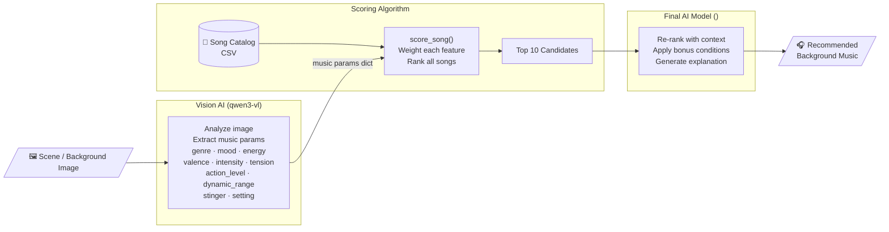
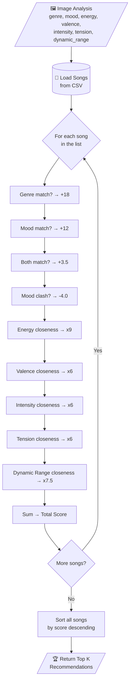

# 🎵 Background Music Recommender


## Original Project Summary

**Base project:** *Music Recommender Simulation* — an Applied AI course assignment (model name: **GenreFirst**).

The original system was a rule-based music recommender that scored a small static catalog of 18 songs against a hand-crafted user taste profile. A user profile stored a favorite genre, favorite mood, target energy, target valence, target danceability, and a set of favorite artists. Each song was scored using a fixed weighted formula: +26 for a genre match, +12 for a mood match, +3.5 bonus when both matched, −4.0 for a mood clash (e.g. chill ↔ aggressive), +2.0 for a favorite artist, and closeness-based points for energy (×9), valence (×6), and danceability (×5), where closeness = 1 − |user\_pref − song\_value|. The top-k songs by total score were returned as recommendations.

Testing across lofi/chill, rock/intense, country/nostalgic, and adversarial profiles revealed that the genre weight dominated — a pop song with completely wrong energy still ranked highly for any pop user — and that missing genres fell back to generic middle-of-the-road results. Identified improvements included a similar-genre bonus, more mood clash pairs, and a penalty for large feature deviations. The project concluded that no single feature weight should exceed the sum of all other weights combined.

## Project Summary

---

## How The System Works

This project has three parts: 
1. The vision ai model describing an image given about some scene or background.
2. A algorithim coded to filter out songs up to the Top 10 songs.
3. A final ai model used to complete the recommendation based on bonus points as well as what is determines on certain conditions.



- The Features used for my recomendation system are: __genre, mood, energy, valence, intensity, Stinger, Action Level, Setting, tension, intensity, dynamic_range__

The main focus is to recommend a scene, or vibe, background music for you. You can use information like reviews credits and general musical analysis. The features I want to define are __genre, mood, energy, valence, intensity, Stinger, Action Level, Setting, Tension, intensity, dynamic_range__. energy, valence, intensity, tension, and dynamic range, action_level have numerical values ranging from 0 to 1 (ex: 0.32, 0.45), with 0 having low tension, intensity, dynamic range, action level, energy. And 1 having high of the same features. The stinger is unique as it is a boolean value. It is sudden musical impacts within the music.

- Song will use the features above as its values to compare with other songs

- Recommender will use weights to compute each feature based on their importance. $$total = (w1 * score_energy) + (w2 * score_valence) + (w3 * score_danceability) + ...$$
- each one will be calculated using $score = 1 - abs(user_preference - song_value)$ which will base on how much it deiviates from the users prefered value for that feature
- the songs that are recommended using the total score calculated. However for better recommendation it would be better to be able to modify the values of user prefrences based on what the user currently wants to listen to and not the overall choice of the user.

How recommenders work is by using data collected from user listening history of the individual and scoring each songs based on each feature, we can give recommendations using a formula like the one above to give more fitting recommendations for the user. The weights provide fine tuning for us to focus more on whats more important for the listener. The app collects data on what songs one will dislike or like and attempts to use the values given to a song to determine the user_preference score for each feature and to limit any deviation from what the user would want to listen.
---
Algorithm recipe: 
- +18.0 points for genre match
- +12.0 for mood match
- +3.5 for double categorical hit (both genre AND mood match)
- -4.0 for mood clash (chill↔aggressive, peaceful↔intense)
- closeness x 9.0 for energy
- closeness x 6.0 for valence
- closeness x 6.0 intensity 
- closeness x 6.0 for tension
- closeness x 7.5 dynamic range
- closeness = 1 - abs(user_pref - song_value)
- 

Genres is still the main bias out of all the features. However, the other features added together is more than it, allowing songs from other genres that might also be good recommendations.
### Screenshots


## Getting Started

### Setup

1. Create a virtual environment (optional but recommended):

   ```bash
   python -m venv .venv
   source .venv/bin/activate      # Mac or Linux
   .venv\Scripts\activate         # Windows
   ```

2. Install Python dependencies:

   ```bash
   pip install -r requirements.txt
   ```

3. Install [Ollama](https://ollama.com) and pull the two AI models used by the pipeline:

   ```bash
   # Install Ollama (Linux/Mac)
   curl -fsSL https://ollama.com/install.sh | sh

   # Vision model — analyzes the input image (src/vision_ai.py)
   ollama pull qwen3-vl:8b-instruct-q4_K_M

   # Text model — final song selection (src/final_decider.py)
   ollama pull qwen3:8b
   ```

   > These are large downloads (~5–8 GB each). Make sure Ollama is running (`ollama serve`) before executing the pipeline.

4. Song catalog — only these two CSV files are valid and should be used:

   - `data/fixed_music_list.csv` — curated cinematic/game tracks with verified or corrected URLs
   - `data/verified_compiled_music_list.csv` — additional verified tracks

   All other CSVs in `data/` are previous work-in-progress exports and can be ignored.

5. Run the full image-to-music pipeline:

   ```python
   from src.vision_ai import analyze_image
   from src.recommender import load_songs, recommend_songs, vision_prefs_to_user_prefs
   from src.final_decider import decide

   # Step 1 — analyze the scene image
   image_profile = analyze_image("path/to/your/image.jpg")

   # Step 2 — load catalog and score songs
   songs = load_songs("data/fixed_music_list.csv")
   songs += load_songs("data/verified_compiled_music_list.csv")
   prefs = vision_prefs_to_user_prefs(image_profile)
   top_songs = recommend_songs(prefs, songs, k=10)

   # Step 3 — final AI picks the best match
   candidates = [song for song, score, _ in top_songs]
   result = decide(image_profile, candidates)
   print(result)
   ```

### Running Tests

Run the starter tests with:

```bash
pytest
```

You can add more tests in `tests/test_recommender.py`.

---

## Experiments You Tried

Use this section to document the experiments you ran. For example:

- What happened when you changed the weight on genre from 2.0 to 0.5
- What happened when you added tempo or valence to the score
- How did your system behave for different types of users

### Experiment 1: modifying weights
__Changed genres weight 26 -> 13__
__Changed energy weight 12 -> 24__

Before: 
After: 

---

## Limitations and Risks

Summarize some limitations of your recommender.

Examples:

- It only works on a tiny catalog
- It does not understand lyrics or language
- It might over favor one genre or mood

__This recommender is very static. It only created using the information of the given songs in songs.csv. If another song with a different genre comes in for example, it wasn't built with it in mind so something like the penalty for mood clash won't apply if the context reqires it to. It doesn't include lyrics which will influence the nuancec and the context of the song. 'Moody' songs for example is very diverse in its subjects. It might mean a sad rainy afternoon at a coffee shop or a somber walk in a dark forest in an alternitive reality kind of music. The lyrics in a romance song can be a tragedy or a happy song. Also two moods might apply to a song.__

---

## Reflection

Read and complete `model_card.md`:

[**Model Card**](model_card.md)

<!-- Write 1 to 2 paragraphs here about what you learned:

- about how recommenders turn data into predictions
- about where bias or unfairness could show up in systems like this
 -->

---

